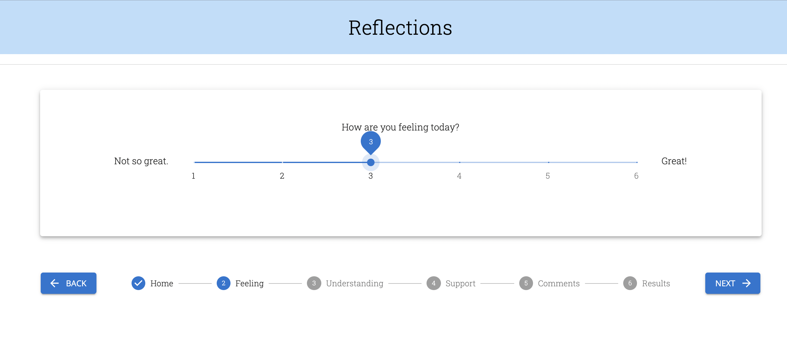
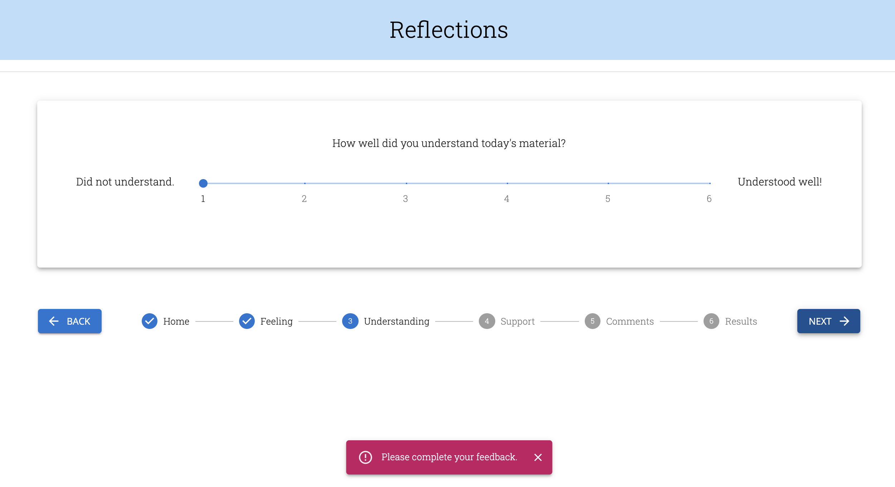
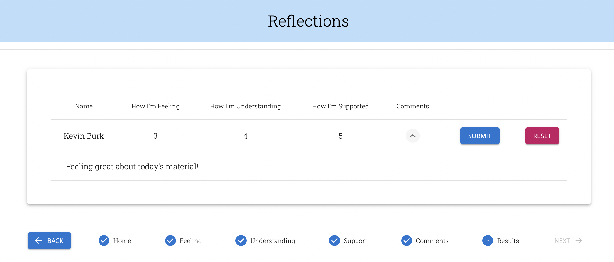
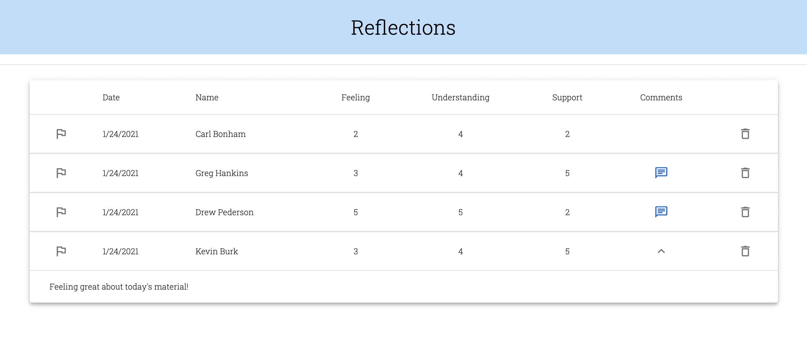

# Project Name

Redux Feedback Loop

## Description

_Duration: Weekend assignment at Prime Digital Academy._

This assignment was essentially to construct the Reflections page we fill out at Prime every day, using Redux and client side routing, which were the topics of this week's study.

The use of Redux and client side routing was fairly straightforward for what this assignment required, so I took it upon myself to really dig into the capabilities of Material UI and make it pretty, functional, and easy to use. I am so excited about the possibilities of Material UI, it's seriously magic.

Using client side routing, the user goes through four pages of feedback: Feeling, Understanding, Support, and Comments. There is validation of the entries on all pages except for Comments, which are optional. Snackbars are there to notify users of the entry requirements. Finally, on the review page, the user can double check all of their entries, use the navigation at the bottom to go back to specific pages, or even hit the Reset button to go back to the first "Feeling" feedback page. If everything looks good, the user can hit "Submit" which sends the feedback entry to the database. The user is then redirected back to "home" with a Snackbar confirming their submission.

## Screen Shots

- Slider

- Validation

- Results Page

- Admin Table

## Prerequisites

- [Node.js](https://nodejs.org/en/)
- [Postgres](https://www.postgresql.org/download/)

## Installation

1. Create a database named `prime_feedback`.
2. The queries for creating the database table are in `tables.sql`. The project is built on [Postgres](https://www.postgresql.org/download/), so you will need to make sure to have that installed. We recommend using Postico to run those queries as that was used to create the queries.
3. Open up your editor of choice and run an `npm install`.
4. Run `npm run server` in your terminal.
5. Run `npm run client` in your terminal, which will open a new browser tab for you.

## Usage

This is an application to collect daily feedback from students.

1. On the home screen, type in your name.
2. Enter your feedback rating (1-6) for each section. (Feeling, Understanding, Support) These fields are required.
3. Enter comments if you'd like. This field is optional.
4. Review your feedback entry. Toggle viewing your comments with the 'Chat' icon. You can hit RESET to start again, or hit SUBMIT, which will send your feedback entry to the database.
5. Visit [localhost:3000/#/admin](http://localhost:3000/#/admin) to see the list of all entries from the database. You can flag entires by clicking the 'Flag' icon, toggle viewing comments by clicking the 'Chat' icon, or delete an entry.

## Built With

- React
- React Router
- Redux
- Material-UI
- Node.js
- Express
- Postgres

## Acknowledgement

Thanks to [Prime Digital Academy](www.primeacademy.io) who equipped and helped me to make this application a reality.

## Support

If you have suggestions or issues, please email me at [percburk@gmail.com](percburk@gmail.com)
